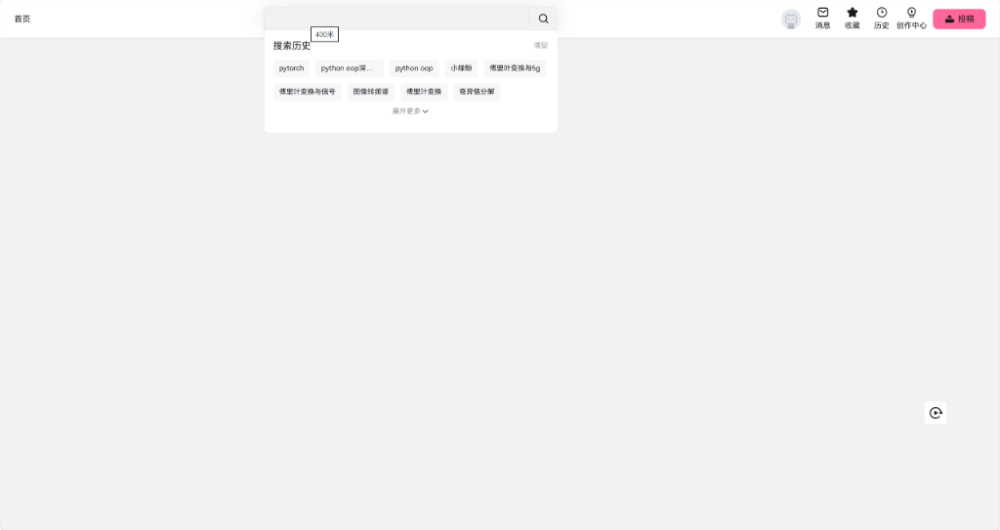

# B站极简净化 - 纯净专注终极版

<p align="center">
  
  
  
  
</p>

<p align="center">
  <b>告别算法投喂与无休止的信息流，还你一个纯净、高效、专注的哔哩哔哩学习与检索环境。</b>
</p>

---

## 目录

- [项目背景与设计理念](#-项目背景与设计理念)
- [效果截图与实测对比](#-效果截图与实测对比)
  - [1. 首页效果 —— 纯白极简，仅留搜索与历史](#1-首页效果--纯白极简仅留搜索与历史)
  - [2. 搜索页效果 —— 精准拔除广告课堂，保护正常教学](#2-搜索页效果--精准拔除广告课堂保护正常教学)
- [功能全景清单](#-功能全景清单)
- [详细安装教程](#-详细安装教程)
  - [第一步：安装脚本管理器扩展](#第一步安装脚本管理器扩展)
  - [第二步：安装本脚本（两种方式）](#第二步安装本脚本两种方式)
- [技术亮点与实现原理](#-技术亮点与实现原理)
- [个性化微调指南](#-个性化微调指南)
- [常见问题解答 (FAQ)](#-常见问题解答-faq)
- [版本更新历史](#-版本更新历史)
- [开源协议与免责声明](#-开源协议与免责声明)

---

## 🎯 项目背景与设计理念

在日常查阅资料、技术学习或备考检索时，打开 B 站首页总会被花哨的顶部联名横幅、不断刷新的推荐视频、大尺寸轮播图以及搜索框里的各类娱乐热搜分散注意力，不知不觉就陷入“无意识刷视频”的算法陷阱。

本脚本融合了经典极简版与功能增强版的核心优势，秉持**“按需索取、专注学习、零干扰”**的理念：
- **首页彻底空白化**：拔除所有推荐流与分类导航，彻底切断被动信息流；
- **核心功能完整保留**：保留个人搜索历史、收藏夹、观看历史、消息通知与个人头像，不破坏日常刚需；
- **精准降噪防误杀**：过滤商业推广广告与付费买课卡片，同时严密保护普通 UP 主的正常教学视频不被误伤。

---

## 📸 效果截图与实测对比

### 1. 首页效果 —— 纯白极简，仅留搜索与历史



* **顶栏纯白美化**：彻底移除顶部花哨的大图/动图 Banner 与联动广告推广，顶栏重置为紧凑清爽的纯白卡片样式，文字与图标转为深色雅致灰黑，粉色“投稿”按钮保持醒目。
* **左侧入口极简**：左侧强行只保留“首页”，隐藏所有多余频道跳转。
* **中间搜索框纯净**：
  * 清空输入框内的默认诱导性推荐词（Placeholder 保持纯净空白）；
  * 下拉菜单彻底隐藏“bilibili热搜”榜单；
  * **完整保留并优先展示个人“搜索历史”**（历史词标签、展开更多与清空按钮完全可用）。
* **右侧功能区精简**：
  * 精准拔除容易分散注意力的“动态”入口；
  * **完整保留核心资产与高频功能**：头像（个人中心）、消息、收藏、历史、创作中心、投稿按钮。
* **首页主体区域**：隐藏频道分类导航条、推荐视频网格、大轮播图与无限瀑布流，全白无干扰。

---

### 2. 搜索页效果 —— 精准拔除广告课堂，保护正常教学


* **搜索功能完整健在**：分类选项卡（综合、视频、番剧、影视、直播、专栏、用户）以及排序筛选（播放多、最新发布、弹幕多等）全部正常运作。
* **精准剔除商业广告**：自动识别并隐藏带有“广告”角标或跳转 `cm.bilibili.com` 的推广卡片。
* **精准剔除付费买课卡片**：自动拦截指向付费课堂平台（`cheese.bilibili.com`）的买课推广内容。
* **智能白名单保护（防误杀机制）**：
  * 采用严格的独立角标与链接判定，**绝不粗暴按标题文字误杀**！
  * 如图中普通 UP 主制作的优质教学视频《课堂 实录教程，线下学员平均 26 K》，虽然标题包含“课堂”二字，依然被完整保留并正常展示，完全不影响学术和技术检索。

---

## 📋 功能全景清单

| 页面模块 | 原始 B 站体验 | 净化后体验 |
| :--- | :--- | :--- |
| **首页顶栏背景** | 经常更换各类大型联名活动图、游戏动图、白字常看不清 | 彻底隐藏大横幅，重置为固定纯白紧凑底色，字标转为深色舒适灰黑 |
| **首页顶栏左侧** | 充斥着直播、番剧、游戏中心、漫画等大量无关入口 | 强行只保留一个“首页”按钮，清爽干练 |
| **首页搜索框** | 默认塞满诱导性热搜词，点击下拉强推热搜排行榜 | 清空默认推荐占位词，隐藏热搜榜，**完整保留真实的个人搜索历史** |
| **首页顶栏右侧** | “动态”常驻小红点，诱导点击无休止的信息流 | 精准拔除“动态”；完整保留**头像、消息、收藏、历史、创作中心、投稿** |
| **首页信息流** | 巨幅轮播图、频道分类导航条、无限下拉推荐视频流 | 彻底清空隐藏，展示极简空白画布，只做你主动搜索时的跳板 |
| **搜索结果页** | 夹杂付费课程推销卡片、商业合作推广卡片 | 精准拔除广告与付费课堂，**智能防误杀**，保留正常教学视频 |
| **视频播放页** | 播放器右侧栏常驻各种游戏/电商推广卡片、横幅广告 | 精准拔除右侧栏广告位与活动横幅，还你看视频时的专注 |
| **个人空间与投稿页** | 空间页面与 `/upload/video` 页面右侧栏常驻无关推荐 | 隐藏右侧多余内容，左侧核心主体区域宽度自适应拉满 100% |

---

## 🚀 详细安装教程

### 第一步：安装脚本管理器扩展

在使用本脚本前，请确保您的浏览器（Chrome、Edge、Firefox、Safari、Brave 等）已安装以下任意一款脚本管理器扩展：

* **篡改猴 (Tampermonkey)**：[官方网站前往安装](https://www.tampermonkey.net/) *(推荐)*
* **脚本猫 (ScriptCat)**：[官方网站前往安装](https://scriptcat.org/)
* **暴力猴 (Violentmonkey)**：[官方网站前往安装](https://violentmonkey.github.io/)

---

### 第二步：安装本脚本（两种方式）

#### 方式一：一键点击在线安装（推荐）

点击下方链接，您的浏览器脚本管理器将自动识别并弹出安装提示，点击**“安装”**或**“更新”**即可：

* 🚀 [直接点击安装最新版本 (GitHub 源)](https://raw.githubusercontent.com/zhengjiewen666/bilibili-minimal-clean/master/bilibili-minimal-clean.user.js)
* ⚡ [国内高速镜像一键安装 (加速源)](https://ghproxy.net/https://raw.githubusercontent.com/zhengjiewen666/bilibili-minimal-clean/master/bilibili-minimal-clean.user.js)

#### 方式二：手动复制代码导入

1. 点击打开本项目脚本源码文件：[`bilibili-minimal-clean.user.js`](./bilibili-minimal-clean.user.js)；
2. 全选并复制文件里的全部 JavaScript 代码；
3. 打开浏览器的 Tampermonkey / 脚本猫 控制面板，点击“新建脚本 / 添加新脚本”；
4. 清空编辑器中的原有模板内容，粘贴刚才复制的代码；
5. 按快捷键 `Ctrl + S`（Mac 用户为 `Cmd + S`）保存；
6. 打开或刷新 [Bilibili 官网](https://www.bilibili.com/)，即可见证极简效果！

---

## 🔬 技术亮点与实现原理

1. **CSS 预加载零闪烁技术 (Zero-Flicker Injection)**：
   * 采用 `@run-at document-start` 模式，在 DOM 树初步解析的最早阶段注入核心样式；
   * 杜绝“先出现推荐视频，然后突然消失”的白屏或元素闪烁问题，丝滑加载。
2. **页面作用域精准隔离机制**：
   * 在脚本执行之初，根据当前访问的 URL 给根节点 `<html>` 动态打上身份标签（例如 `data-bili-clean-page="home"`）；
   * 首页专用的隐藏规则严格限制在首页作用域内生效，**从根本上避免了误伤搜索页、播放页相关视频、收藏夹和历史记录里的正常视频卡片**。
3. **Shadow DOM 穿透处理**：
   * 兼容 B 站全新版本的 Web Components 组件（如 `<bili-header>` 和 `<bili-search-bar>`），穿透进入其内部的 `shadowRoot` 清理输入框推荐词与导航栏，确保未来版本更新依然稳固可用。
4. **高性能事件调度与节流**：
   * 使用现代浏览器的 `MutationObserver` 监听 DOM 树的动态增量节点，配合 `requestAnimationFrame` 防抖与节流，取代传统的 100ms 暴力死循环轮询，在保证秒级净化的同时大幅降低浏览器内存与 CPU 负载。
5. **智能防误杀过滤器**：
   * 结合 CSS 现代伪类 `:has()` 与高精度 DOM 节点审查，只对带有特定广告/课堂外链或独立角标的卡片进行拦截，**严禁使用粗暴的“包含课堂文字就隐藏”**，保障正常知识检索体验。

---

## ⚙️ 个性化微调指南

脚本设计考虑了高度的代码可读性，如果您有独特的个性化需求，可以在油猴编辑器中非常轻松地修改对应配置：

### 1. 如果想重新显示顶栏的“动态”：
在脚本中找到如下代码段，将 `// 仅精准移除“动态”` 下方的判断注释掉即可：
```javascript
// if (text.includes('动态') || href.includes('t.bilibili.com')) {
//   item.style.setProperty('display', 'none', 'important');
// }
```

### 2. 如果想保留首页顶部的频道分类栏：
在脚本的 `css` 变量中，找到并删除或注释掉如下选择器：
```css
/*
.bili-header__channel,
div[class*="header__channel"],
.channel-icons,
.channel-links,
.channel-entry-more {
    display: none !important;
}
*/
```

---

## ❓ 常见问题解答 (FAQ)

#### Q1：为什么我的个人搜索历史还在？
> **A**：这正是本脚本的独家核心特色！很多净化脚本会把搜索下拉面板整个干掉，导致自己刚刚搜过的词也找不到了。本脚本精准拔除了“热搜榜”与“推荐词”，**特意完整保留了您个人的真实搜索历史**，既防分心又保效率。

#### Q2：在搜索页面，普通教学视频会被隐藏吗？
> **A**：绝对不会！本脚本内置了智能防误杀算法。只要是普通 UP 主投稿的教学视频（即便标题里包含“课堂”、“课程”等字样），都会原样保留并正常展示；只有 B 站官方的付费 Cheese 课堂与商业投放广告才会被拦截。

#### Q3：为什么首页顶栏变成了纯白色？
> **A**：因为原版 B 站首页顶栏是半透明悬浮在巨幅活动宣传横幅之上的。本脚本为了极简净化，移除了花哨的大横幅；为了避免白底白字无法看清，我们将顶栏重置为清爽高对比度的纯白卡片风格，图标与文字也相应适配为舒适的深灰色。

#### Q4：脚本有新版本如何更新？
> **A**：脚本管理器（Tampermonkey / 脚本猫）默认每天会自动检查 GitHub 仓库的更新。您也可以随时在脚本管理器中点击“检查脚本更新”手动获取最新代码。

---

## 📜 版本更新历史

### v18.0 (终极融合版)
- 🎉 **双版本深度融合**：全面整合极简空白首页与高精度广告拦截两大版本的核心代码；
- 🛡️ **防误杀算法升级**：重构搜索结果过滤逻辑，通过独立角标与协议外链识别，彻底避免误杀标题含“课堂”的良心视频；
- 🎨 **视觉细节打磨**：纯白顶栏文字色阶、搜索框边框柔化与阴影重构，保留高辨识度的粉色投稿按钮；
- ⚡ **性能全面提升**：引入作用域隔离标记与 MutationObserver 节流调度，首屏加载零闪烁，运行无卡顿；
- 📖 **全中文文档重构**：编写超详细图文对照 README 与开源规范。

---

## 📄 开源协议与免责声明

- 本项目采用 [MIT 许可证](./LICENSE) 开放源代码，您可以自由学习、修改和分发。
- 本脚本仅用于个人前端样式美化与学习效率提升，不篡改任何网络请求与用户数据，亦不用于任何商业用途。
- 哔哩哔哩（Bilibili）的商标及相关知识产权归其合法权利人所有。
